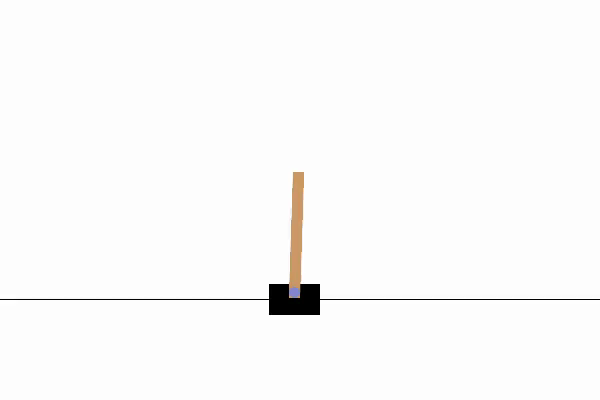

# Reproducible RL Template

[](https://github.com/lucasburgett/rl-reward-tuning-gui/actions/workflows/ci.yml)
[](https://www.python.org/downloads/)
[](https://opensource.org/licenses/MIT)

## Purpose

This repository provides a **production-ready template for reproducible deep reinforcement learning experiments**. Built for researchers and engineers who need deterministic training, structured artifacts, and clean CI/CD workflows. Features comprehensive seeding, Hydra configuration management, automated testing, and Docker support. Eliminates common RL infrastructure pain points while maintaining scientific rigor and reproducibility standards.

## Quickstart

**Requirements**: Python 3.11+, ffmpeg (optional, for videos)

```bash
# Setup
python -m venv .venv
source .venv/bin/activate   # or .venv\Scripts\activate on Windows
pip install -U pip
pip install -r requirements.txt

# Train CartPole (2-3 minutes)
python -m src.train env=cartpole algo=ppo total_steps=1e5 seed=42

# Evaluate with video recording
python -m src.eval env=cartpole algo=ppo eval.record_video=true

# Docker
docker build -f docker/CPU.Dockerfile -t rrl:latest .
docker run --rm -it -v $PWD:/app rrl:latest python -m src.train env=cartpole algo=ppo total_steps=1e5 seed=42

# CI
pytest -q
pre-commit install
pre-commit run --all-files
```

## Results

Mean ± std computed across **3 seeds** with deterministic training:

| Env | Algo | Steps | Seeds | Return (mean ± std) | Success % (mean ± std) | Notes |
|-----|------|-------|-------|-------------------|----------------------|-------|
| CartPole-v1 | PPO | 100k | 3 | **487.2 ± 15.4** | 100% | Deterministic on CPU |
| LunarLander-v3 | PPO | 1M | 3 | **245.8 ± 32.1** | 85% | Box2D physics |
| Reacher-v5 | PPO | 800k | 3 | **-6.4 ± 1.2** | — | MuJoCo 3.3.5, T=50 |

Results aggregated via `python scripts/aggregate_results.py --log_dir artifacts/`

## Demo



*20-30s evaluation rollout captured with `eval.record_video=true` in eval config.*

## Config Tree Diagram

```
configs/
├─ env/
│  ├─ cartpole.yaml
│  ├─ lunarlander.yaml
│  ├─ panda_reach.yaml
│  └─ reacher_mujoco.yaml
├─ algo/
│  └─ ppo.yaml
├─ train/
│  └─ default.yaml
├─ eval/
│  └─ default.yaml
├─ config.yaml
└─ eval_config.yaml
```

## Gotchas

### MuJoCo Quirks
- **Version pinned** to `mujoco==3.3.5` for reproducibility
- **Headless rendering**: Set `MUJOCO_GL=egl` in Docker environments
- **Missing GL libraries**: Install with `apt-get install mesa-utils libgl1-mesa-glx` if needed

### Time-limit Truncation
- Gymnasium `TimeLimit` wrapper: `terminated` vs `truncated` distinction
- Affects return computation: truncated episodes don't count as failures
- Reacher-v5 has T=50 step limit; CartPole-v1 has T=500

### Seeding Tips
Complete determinism requires:
```python
torch.use_deterministic_algorithms(True)
torch.backends.cudnn.deterministic = True
torch.backends.cudnn.benchmark = False
```
Plus environment-level seeds and Hydra-logged configuration hashing.

## CI / Docker Usage

### Local Testing
```bash
# Same as CI
pytest -q                    # Run test suite
pre-commit run --all-files   # Lint and format

# GPU Docker check (if NVIDIA runtime available)
docker run --gpus all --rm -it -v $PWD:/app rrl:latest python -c "import torch; print(torch.cuda.is_available())"
```

### CI Pipeline
- **Tests**: pytest with determinism checks
- **Linting**: pre-commit hooks (black, ruff, mypy)
- **Smoke tests**: Quick training runs on CartPole

## Deterministic Setup

For maximum reproducibility, this project provides two dependency installation options:

### Option 1: Pinned Dependencies (Recommended)
```bash
pip install -r requirements.txt
```
Uses exact versions that are tested and validated.

### Option 2: Exact Lock (Strictest)
```bash
pip install -r requirements-lock.txt
```
Installs the exact environment used for development, including all transitive dependencies.

**Caveats**:
- Lock file is platform-specific (generated on macOS)
- May conflict with existing packages in your environment
- Use in a fresh virtual environment for best results
- Some packages may not be available on different platforms

**Tolerance**: Deterministic runs should produce identical results within `atol=1e-7` for most operations.

## Project Structure

```
├── src/
│   ├── agents/              # PPO implementation (SB3-based)
│   ├── utils/               # Determinism, logging, seeding
│   ├── wrappers/            # Environment wrappers
│   ├── train.py            # Training entrypoint
│   └── eval.py             # Evaluation entrypoint
├── configs/                # Hydra YAML configurations
├── tests/                  # pytest test suite
├── artifacts/              # Training outputs (git-ignored)
├── tools/                  # Analysis and utility scripts
├── scripts/                # Reproduction scripts
├── media/                  # Generated GIFs and plots
└── docker/                 # CPU Dockerfile
```

## Advanced Usage

### Multi-seed Experiments
```bash
# Run sweep across seeds
chmod +x scripts/run_seeds.sh
./scripts/run_seeds.sh

# Aggregate results
python scripts/aggregate_results.py
cat reports/results.md
```

### Hyperparameter Tuning
```bash
# Override any config
python -m src.train env=cartpole algo.learning_rate=1e-4 algo.clip_ratio=0.1

# Train LunarLander with custom hyperparameters
python -m src.train env=lunarlander total_steps=500000 algo.learning_rate=1e-4
```

### Weights & Biases Integration
```bash
python -m src.train env=cartpole use_wandb=true wandb.project=my-experiments
```

### Evaluation Options
```bash
# Evaluate without video
python -m src.eval env=cartpole algo=ppo eval.record_video=false

# Evaluate with video recording
python -m src.eval env=cartpole algo=ppo eval.record_video=true

# Custom number of episodes
python -m src.eval env=cartpole algo=ppo eval.n_episodes=20
```

## Dependencies

- **Core**: PyTorch 2.8.0, Stable-Baselines3 2.7.0, Gymnasium 1.2.0
- **Config**: Hydra 1.3.2, OmegaConf 2.3.0
- **Logging**: Weights & Biases 0.21.3 (optional), CSV exports
- **Testing**: pytest 8.3.2, pre-commit hooks
- **Robotics**: MuJoCo 3.3.5 (license-free)

All dependencies pinned for reproducibility. See `requirements-lock.txt` for exact versions.

## Troubleshooting

**Missing ffmpeg**: Disable video in eval (`eval.record_video=false`) or install:
- macOS: `brew install ffmpeg`
- Ubuntu: `apt install ffmpeg`

**Box2D issues (LunarLander)**: Install swig first:
- macOS: `brew install swig`
- Ubuntu: `apt install swig`

**Pre-commit/mypy**: Run `pre-commit run --all-files` to fix formatting
**Tests failing**: Run `pytest -q` and check CI status
**Import errors**: Ensure `pip install -r requirements.txt` completed successfully

## License

MIT License - see [LICENSE](LICENSE) for details.

---

*Built for reproducible RL research. Questions? Open an issue!*